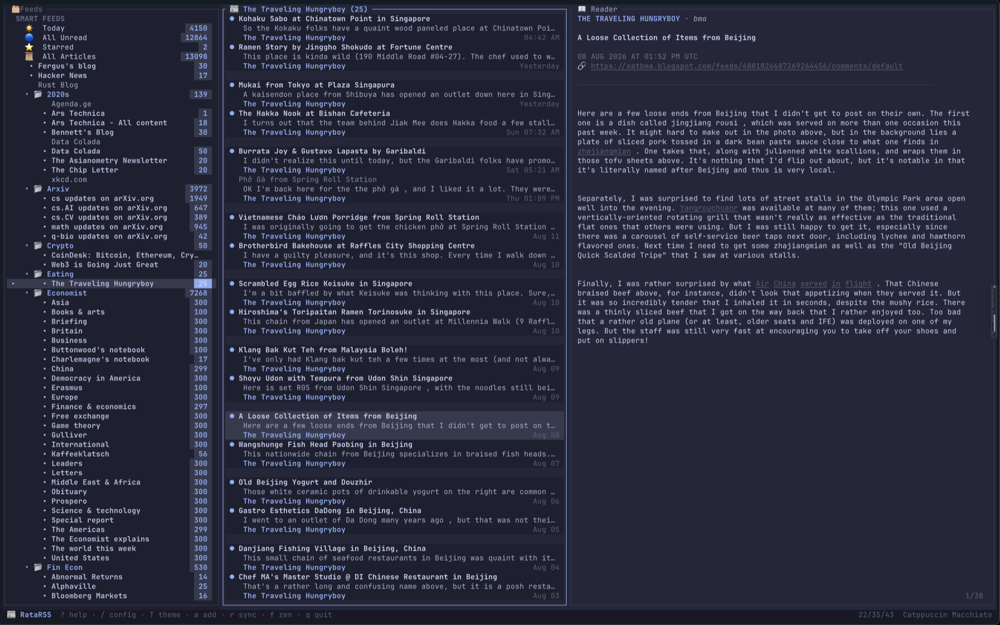
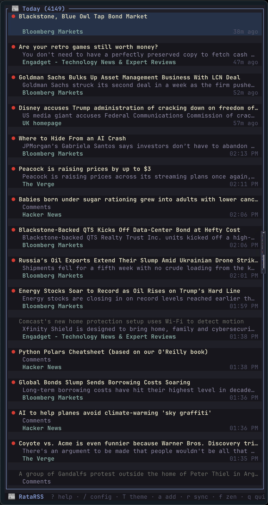
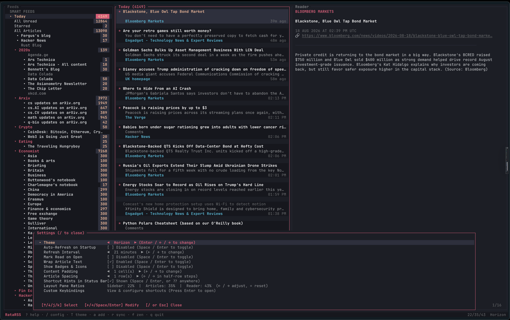

# 📰 RataRSS

A modern, beautiful, extremely fast RSS reader for your terminal.

Built with [Ratatui](https://ratatui.rs) in Rust.


---

RataRSS keeps every article you have ever fetched, compressed, on disk — and
still opens one in about **35 microseconds**. It reads like a native app, runs in
any terminal, and never makes you wait.



<p align="center"><em>Sidebar, article list and reader — Catppuccin Macchiato.</em></p>

---

## Why it feels fast

Every number below was measured on a real library: **13,098 articles across 474
feeds**, a 21 MB database, on an ordinary laptop.

| Action | Time |
|---|---|
| Open an article — fetch, decompress, format | **35 µs** median · 49 µs p90 · 164 µs p99 |
| Open *All Unread* — 12,864 articles | **8.9 ms** |
| Open *Today* — 4,224 articles | **1.6 ms** |
| Fuzzy search, per keystroke, across 13,098 articles | **8–10 ms** |
| Resident memory, whole app | **21 MB** |

Nothing is precomputed overnight. There is no background daemon. The speed comes
from four decisions.

**The list never touches a compressed column.** Every article stores a short
plain-text snippet beside its compressed body, so drawing a list of 13,000
articles decompresses exactly nothing. Only the article you are actually reading
is ever expanded.

**The database sorts with an index, not a temp table.** Views order by a stored
sort key with covering indexes behind it, so SQLite walks rows that are already in
order instead of sorting the whole table on every click.

**Frames copy nothing.** Panes borrow the article list rather than cloning it, and
the reader holds its formatted, wrapped, styled text until the article, the pane
width or the theme actually changes. Scrolling redraws; it does not re-parse.

**The event loop sleeps.** It idles at 250 ms, wakes to 100 ms only while syncing,
and drains a whole burst of input before drawing — so holding `j` scrolls with the
key instead of trailing a frame behind it.

---

## Storage that forgets nothing

Your library is an embedded SQLite database in WAL mode. **Nothing is ever deleted
unless you delete it.** No article cap, no retention window, no silent pruning.

Bodies and summaries are transparently compressed with **Zstandard** — typically
75–85% smaller. The library above holds 5.3 MB of compressed text and decompresses
at gigabytes per second, which is why opening an article is dominated by
formatting rather than by I/O.

Feeds sync concurrently in the background, ten at a time, without ever blocking
the interface.

---

## Three panes

**Sidebar** — Smart views (*Today*, *All Unread*, *Starred*, *All Articles*) above
your folders and feeds, each with an unread badge. Folders collapse.

**Article list** — Multi-line cards: unread dot, star, title, snippet, source, and
a relative timestamp.

**Reader** — Real typography: headings, blockquotes, code blocks, lists and links.
Links are drawn underlined and **open in your browser when you click them**.

Move between panes with `Tab`, arrow keys, `h`/`l`, or by clicking. Jump straight
to one with `1`, `2`, `3`. Scroll with `j`/`k`, arrows, `PageUp`/`PageDown`,
`Space`, or the mouse wheel — the wheel scrolls whichever pane is under the
pointer.

Press `f` for **Zen mode** and the focused pane fills the screen.

<p align="center">
  
</p>

<p align="center"><em>Zen mode — one pane, nothing else.</em></p>

---

## Fuzzy finding

`Ctrl+A` finds **articles** in the current view. `Ctrl+F` finds **feeds** — the
sidebar collapses to a flat, best-first list; arrows move, `Enter` opens, `Esc`
restores.

Matching is subsequence-based and ranked, so `bm` finds *Bloomberg Markets* and
`hn` finds *Hacker News*. Word starts, prefixes and consecutive runs score higher,
which puts the result you meant at the top rather than merely somewhere in the
list.

---

## Yours to shape

**46 themes**: RataRSS Dark and Light, all four Catppuccins, Tokyo Night (plus
Storm, Moon, Day), Gruvbox, Gruvbox Material, Nord, Dracula, Solarized, Rosé Pine
(plus Dawn, Moon), Monokai Pro, One Dark, GitHub, Kanagawa, Everforest, Horizon,
Nightfox, Ayu (Dark, Mirage, Light), Material Ocean, Zenburn, Iceberg, Oxocarbon,
Melange, Poimandres, Vesper, Flexoki, PaperColor, Cyberpunk Neon and Minimal
Monochrome.

Light themes always sort to the bottom of the picker — classified by measuring
each palette's background, not by trusting its name.

Press `/` for settings. Everything saves the moment you change it:

- **Theme**, with a live searchable picker (`T`)
- **Content padding**, 0–6 cells
- **Article spacing**, in half-row steps
- **Icons on or off** — every emoji in the interface disappears
- **Shortcut hints** in the status bar, or toggle them anywhere with `??`
- **Pane proportions**, auto-refresh, refresh interval, mark-read behaviour



<p align="center"><em>Settings open over the Horizon theme. Every change saves immediately.</em></p>

Every key is rebindable in `~/.config/ratarss/config.toml`.

The interface itself stays out of the way: one status line at the bottom, no
header bar, no chrome you did not ask for.

---

## Quick start

```bash
git clone https://github.com/deep-blue-dark-red/RataRSS.git
cd RataRSS
cargo build --release
./target/release/ratarss
```

The binary is 8 MB and depends on nothing but your terminal. SQLite is compiled
in.

### Bring your feeds

```bash
ratarss --import subscriptions.opml     # OPML 1.0 and 2.0, nested folders
ratarss --export backup.opml
ratarss --add https://example.com/feed --folder News
ratarss --theme "Rosé Pine"
```

Or do it in the app: `a` to add a feed or import OPML, `e` to export. Point `--add`
at a website rather than a feed and RataRSS will discover the feed for you.

---

## Keys

| | |
|---|---|
| `Tab` / `Shift+Tab` | Cycle panes |
| `1` `2` `3` | Sidebar / articles / reader |
| `j` `k` · arrows · wheel | Move and scroll |
| `g` / `G` | Top / bottom |
| `Enter` | Open selection |
| `Ctrl+A` / `Ctrl+F` | Fuzzy find articles / feeds |
| `m` / `M` | Mark read / mark all read |
| `s` | Star |
| `o` | Open in browser |
| `y` | Copy link |
| `r` / `R` | Refresh feed / all feeds |
| `a` / `e` / `d` | Add / export / delete |
| `f` | Zen mode |
| `/` · `T` | Settings · themes |
| `?` · `??` | Help · toggle status-bar hints |
| `q` | Quit |

---

## Building

```bash
cargo test              # unit, integration and render tests
cargo build --release   # LTO, single codegen unit
```

Requires Rust 1.75+ and a terminal with 24-bit colour. Developed and measured on
macOS.

---

## License

MIT.
